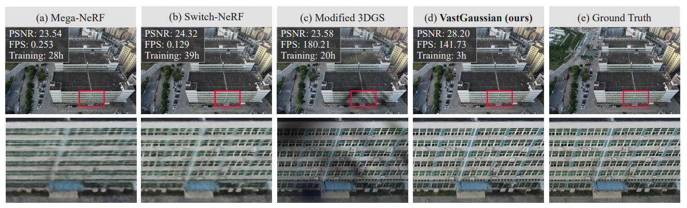

# VastGaussian
This is [Chinese](CHINESE.md) Version.



This is `VastGaussian: Vast 3D Gaussians for Large Scene Reconstruction` unofficial implementation, since this is my first time to recreate the complete code from scratch, the code may have some errors, and the code writing may seem a bit naive compared to some experts. Lack of engineering skills. But I got my foot in the door. I couldn't find any implementation of VastGaussian on the web, so I gave it a try.

If you have any experiences and feedback on any code changes, feel free to contact me, or simply raise an Issue :grinning::

> Email: 374774222@qq.com
> 
> QQ: 374774222
> 
> WeChat: k374774222

## ToDo List
- [x] ~~Camera-position-based region division is implemented~~

- [x] ~~Position-based data selection is implemented~~

- [x] ~~Visibility-based camera selection is implemented~~

- [x] ~~Coverage-based point selection is implemented~~

- [x] ~~Decoupled Appearance Modeling is implemented~~

- [x] ~~Seamless Merging is implemented~~

- [x] ~~For non-standard scenes by manual Manhattan alignment~~

- [ ] Parallel training of $m\times n$ regions on a single GPU is implemented after dividing the point cloud

- [ ] Experiments are carried out on UrbanScene3D and Mill-19 datasets
- [ ] Fix bugs, and bugs, and bugs ...
- [ ] Automatic ground estimation and Manhattan alignment

## Some notes

1. I made some changes to the original 3DGS. First of all, I took the hyperparameters of 3DGS from `arguments/__init__.py` and put them into `arguments/parameters.py` file to make it easier to read and understand the hyperparameters
2. In order not to change the original directory structure of 3DGS, I added a new `VastGaussian_scene` module to store VastGaussian. Part of the code I called the existing functions in the `scene` folder. Also to fix the `import` error, I moved the Scene class into the datasets.py folder

<div align="center">
     
    
</div>

3. The naming of the files is consistent with the method mentioned in the paper for easy reading

> - `datasets.py` I have rewritten the Scene class in 3DGS into BigScene and PartitionScene. The former represents the original scene BigScene, and the latter represents the PartitionScene of each small scene after Partition.
> - `data_partition.py` corresponding to the `Progressive Data Partitioning` in the paper.
> 
> 
> 
> - `decouple_appearance_model.py`  corresponding to the `Decoupled Appearance Modeling` in the paper.
>  
>    <div align="center">
>        
>        
>    </div> 
>
> - `graham_scan.py` convex hull calculation is used to project the partition cube onto the camera plane and calculate the intersection of the projected region and the image region when implementing Visibility based camera selection.
> 
> - `seamless_merging.py` corresponding to the `Seamless Merging` in the paper.

4. I have added a new file `train_vast.py` to modify the process of training VastGaussian, if you want to train the original 3DGS, please use `train.py`.
5. The paper mentioned `Manhattan world alignment, so that the Y-axis of the world coordinate is perpendicular to the ground plane`, I asked the experts to know that this thing can be adjusted manually using `threejs`: https://threejs.org/editor/, after manually adjusting the scene you get the --position and --rotation parameters, just take them as command line arguments and train.

> - After importing your initial point cloud via File-->Import you can check if your initial point cloud needs to be Manhattan aligned, if it looks like this
> 
> -Now you can adjust your point cloud so that the ground is perpendicular to the y-axis and the boundaries are as parallel as possible to the x- and z-axis with the help of the options on the left, but of course you can also use the editing area on the right to directly enter the corresponding values.
>    <div align="center">
>        
>        
>    </div> 
> - Then you can get the appropriate parameters in the right edit area.

6. In the process of implementation, I used a small range of data provided by 3DGS for testing. Larger data can not run on the native computer, and a large range of data requires at least **32G video memory** according to the instructions of the paper.
7. In the implementation process, some operations in the paper, the author is not very clear about the details, so some implementation is based on my guess and understanding to complete, so my implementation may have some bugs, and some implementation may be a little stupid in the eyes of the expert, if you find problems in the use of the process, please contact me in time, progress together.

## Using

1. The data format is the same as 3DGS, and the training command is basically the same as 3DGS. I didn't make too many personalized changes, you can refer to the following command (see `arguments/parameters.py` for more parameters):
if you want to perform manhattan alignment:
```python
python train_vast.py -s datasets/xxx --exp_name xxx --manhattan --pos xx xx xx --rot xx xx xx
```
otherwise:
```python
python train_vast.py -s datasets/xxx --exp_name test
```

## Datasets
1. `Urbanscene3D`: https://github.com/Linxius/UrbanScene3D

2. `Mill-19`: https://opendatalab.com/OpenDataLab/Mill_19/tree/main/raw

3. test data for this implementation: https://repo-sam.inria.fr/fungraph/3d-gaussian-splatting/datasets/input/tandt_db.zip

# Contributors
Happily, we now have several contributors working on the project, and we welcome more contributors to join us to improve the project. Thank you all for your work.

<a href="https://github.com/VerseWei">
  
</a>
