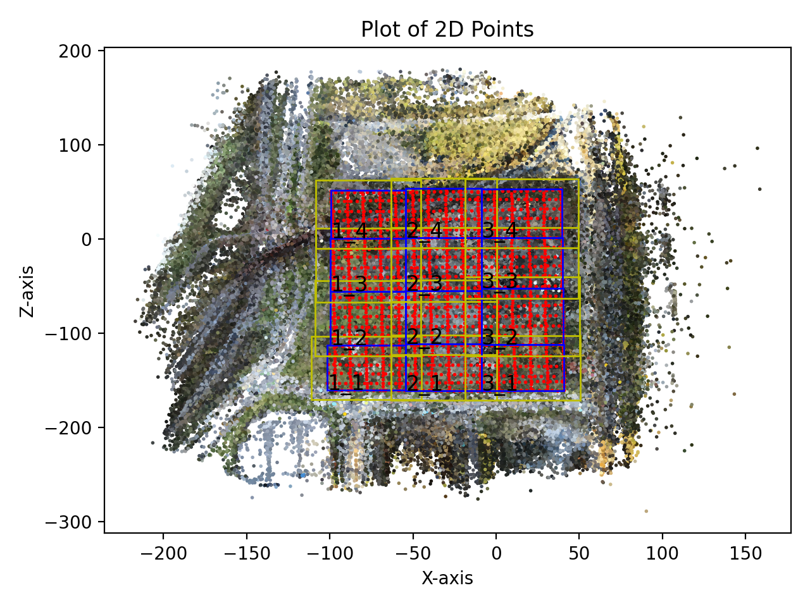
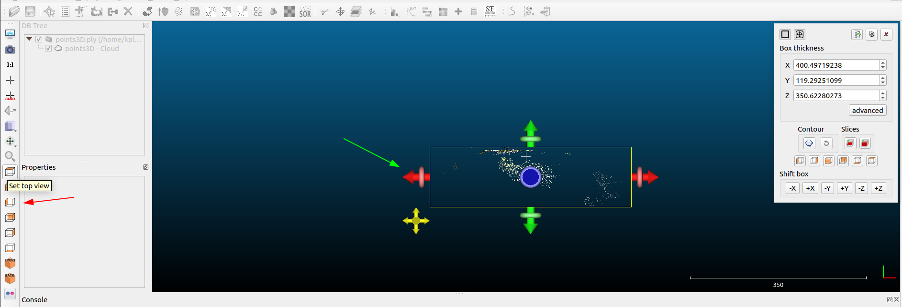
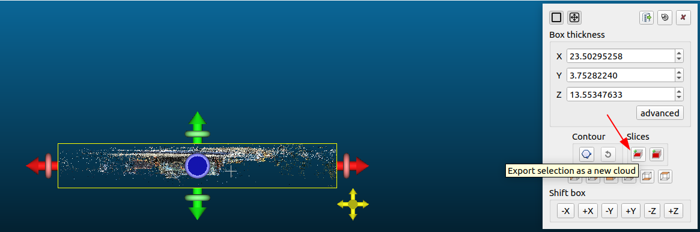
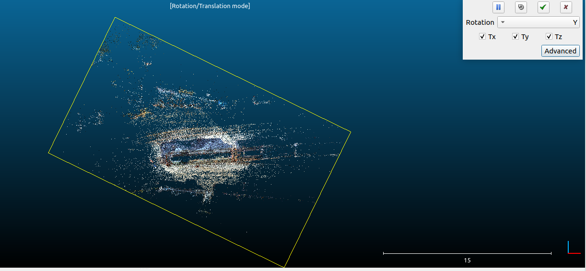

# VastGaussian


This is `VastGaussian: Vast 3D Gaussians for Large Scene Reconstruction` unofficial implementation, since this is my first time to recreate the complete code from scratch, the code may have some errors, and the code writing may seem a bit naive compared to some experts. Lack of engineering skills. But I got my foot in the door. I couldn't find any implementation of VastGaussian on the web, so I gave it a try.

If you have any experiences and feedback on any code changes, feel free to contact me, or simply raise an Issue :grinning::

> Email: 374774222@qq.com
> 
> WeChat: k374774222

## ToDo List
- [x] ~~Refactor repository <a style="color: red">Important !</a>~~

- [x] ~~Camera-position-based region division is implemented~~

- [x] ~~Position-based data selection is implemented~~

- [x] ~~Visibility-based camera selection is implemented~~

- [x] ~~Coverage-based point selection is implemented~~

- [x] ~~Decoupled Appearance Modeling is implemented~~

- [x] ~~Fixed high RAM and VRAM usage issues, it is now possible to train the first few iteration on a 12GB GPU and 32GB of RAM~~

- [x] ~~Fix Decoupled Appearance Modeling that didn't work well~~

- [x] ~~Seamless Merging is implemented~~

- [x] ~~For non-standard scenes by manual Manhattan alignment~~

- [x] ~~Parallel training of $m\times n$ regions on $n$ GPUs is implemented after dividing the point cloud~~ Thanks [livion](https://github.com/Livioni) a lot.

- [x] ~~Refine Data Partition~~

- [x] ~~Refine Seamless Merging~~

- [x] ~~update color correct and LPIPS (using alex net) while evaluation~~

- [ ] Experiments are carried out on UrbanScene3D and Mill-19 datasets

- [ ] Fix bugs, and bugs, and bugs ...

## Some notes

1. In order not to change the original directory structure of 3DGS, I added a new `scene/vastgs` module to store VastGaussian. Part of the code I called the existing functions in the `scene` folder. Also to fix the `import` error, I moved the Scene class into the datasets.py folder

<div align="center">
    
</div>

2. The naming of the files is consistent with the method mentioned in the paper for easy reading

> - `data_partition.py` corresponding to the `Progressive Data Partitioning` in the paper.
>  <div align="center">
>       
>       
>  </div>
>
> - `scene/vastgs/appearance_network.py`  corresponding to the `Decoupled Appearance Modeling` in the paper. I refer to the implementation of [gaussian-opacity-fields](https://github.com/autonomousvision/gaussian-opacity-fields)
>  
>    <div align="center">
>        
>        
>    </div> 
>
> - `graham_scan.py` convex hull calculation is used to project the partition cube onto the camera plane and calculate the intersection of the projected region and the image region when implementing Visibility based camera selection.
> 
> - `seamless_merging.py` corresponding to the `Seamless Merging` in the paper.

4. I have added a new file `train_vast.py` to modify the process of training VastGaussian, if you want to train the original 3DGS, please use `train.py`.
5. The paper mentioned `Manhattan world alignment, so that the Y-axis of the world coordinate is perpendicular to the ground plane`, I asked the experts to know that this thing can be adjusted manually using `threejs`: https://threejs.org/editor/ or the software `cloudcompare`, after manually adjusting the scene you get the --position and --rotation parameters, just take them as command line arguments and train.

> ## 1. Using `threejs` for Manhattan alignment
> - After importing your initial point cloud via File-->Import you can check if your initial point cloud needs to be Manhattan aligned, if it looks like this
>  <div align="center">
>       
>  </div>
> - Now you can adjust your point cloud so that the ground is perpendicular to the y-axis and the boundaries are as parallel as possible to the x- and z-axis with the help of the options on the left, but of course you can also use the editing area on the right to directly enter the corresponding values.
>    <div align="center">
>        
>        
>    </div> 
> - Then you can get the appropriate parameters in the right edit area.
> 
> ## 2. Using `cloudcompare` for Manhattan alignment
> - Open the cloudcompare software and import the sparse point cloud into the software.
> <div align="center">
>  
> </div>
>
> - Use the `cross section` tool in the toolbar to reduce the scope of the point cloud to only the areas you are interested in (for easier alignment), or you can leave them out.
> Then you can use the toolbar on the left of the <a style="color: red">red arrow</a> to adjust your viewing Angle (there are 6 viewing angles), and finally drag the arrow pointed by the <a style="color: green">green arrow</a> to adjust the area you are interested in.
> <div align="center">
>   
>   
> </div>
>
> - After you have adjusted the point cloud, you can export it as a new point cloud, noting that there is no transformation of coordinates involved. Then close the box on the right.
> Select the exported point cloud and deselect the initial point cloud.
> <div align="center">
>  
>  
> </div>
>
> - Use the `Translate/Rotate` tool on the toolbar to adjust the pose of the point cloud.
> Click `Rotation` to select the axis around which you want to rotate. If you want to adjust both the rotation matrix and the transfer vector, you can tick `Ty Ty Tz`
> Also select the toolbar on the left to adjust the viewing Angle.
> <div align="center">
>  
>  
> </div>
>
> - The Manhatton alignment mentioned in the paper can be realized by manually adjusting the pose of the point cloud so that the boundary frame x and z axis of the point cloud are parallel.
> And you can get the transformation matrix relative to the initial point cloud after this adjustment in the software console. Let's call it `A1`
> <div align="center">
>  
>  
>  
>  
> </div>
>
> - If you only adjust once, then A1 is the final transformation matrix (`A=A1`), if you adjust the pose of the point cloud several times in A row, assuming 3 adjustments, and get the transformation matrix `A1 A2 A3`, then the final transformation matrix is `A= A3*A2*A1`
> <div align="center">
>  
> </div>
> 
> - Enter the resulting transformation matrix into the command line.

6. In the process of implementation, I used a small range of data provided by 3DGS for testing. Larger data can not run on the native computer, and a large range of data requires at least **32G video memory** according to the instructions of the paper.
7. In the implementation process, some operations in the paper, the author is not very clear about the details, so some implementation is based on my guess and understanding to complete, so my implementation may have some bugs, and some implementation may be a little stupid in the eyes of the expert, if you find problems in the use of the process, please contact me in time, progress together.

## For Training and Evaluation
You can refer to the parameter Settings in the files `train_vast.sh` and `eval_vast.sh`

1. The data format is the same as 3DGS, and the training command is basically the same as 3DGS. I didn't make too many personalized changes, you can refer to the following command (see `arguments/parameters.py` for more parameters):
if you want to perform manhattan alignment:

### Train your own dataset

Using `threejs` for Manhattan alignment

```python
python train_vast.py -s datasets/xxx --exp_name xxx --manhattan --plantform threejs --pos "xx xx xx" --rot "xx xx xx"
```

Using `cloudcompare` for Manhattan alignment

```python
# The 9 elements of the rotation matrix should be filled in rot
python train_vast.py -s datasets/xxx --exp_name xxx --manhattan --plantform cloudcompare --pos "xx xx xx" --rot "xx xx xx xx xx xx xx xx xx"

```

Train without Manhattan alignment:

This may cause an error because the Manhattan alignment is not performed, which may cause an error when the data partition is executed
```python
python train_vast.py -s datasets/xxx --exp_name test
```

### Train Mill-19 and Urbanscene3D
I get the preprocessed data from https://vastgaussian.github.io/, and implement Manhattan alignment, you can use my pos and rot params.
```python
# train rubble
python train_vast.py -s ../datasets/Mill19/rubble \
--exp_name rubble \
--manhattan \
--eval \
--llffhold 83 \
--resolution 4 \
--pos "25.607364654541 0.000000000000 -12.012700080872" \
--rot "0.923032462597 0.000000000000 0.384722054005 0.000000000000 1.000000000000 0.000000000000 -0.384722054005 0.000000000000 0.923032462597" \
--m_region 3 \
--n_region 3 \
--iterations 60_000

# train building
python train_vast.py -s ../datasets/Mill19/building \
--exp_name building \
--manhattan \
--eval \
--llffhold 83 \
--resolution 4 \
--pos "-62.527942657471 0.000000000000 -15.786898612976" \
--rot "0.932374119759 0.000000000000 0.361494839191 0.000000000000 1.000000000000 0.000000000000 -0.361494839191 0.000000000000 0.932374119759" \
--m_region 3 \
--n_region 3 \
--iterations 60_000
```
#### Additional Parameter

I added new parameters in `arguments/__init__.py`
<details>
<summary><span style="font-weight: bold;">New Parameters for train_vast.py</span></summary>

#### --exp_name
Experiment name
#### --manhattan
`store_true`, Whether to perform Manhattan alignment
#### --plantform
Platform for Manhattan alignment, choose in "cloudcompare" and "threejs"
#### --pos
Translation vector
#### --rot
rotate matrix
#### --man_trans
default=None, transformational matrix
#### --m_region
the number of regions in the x direction
#### --n_region
the number of regions in the z direction
#### --extend_rate
The rate of boundary expansion
#### --visible_rate
Airspace-aware visibility rate
</details>


### Render and Evaluate Mill-19 and Urbanscene3D
*Evaluation method*: During training, every 83 images were used as a test image (`llffhold=83`). For rubble, 21 images were selected and added to the test set. 

[//]: # (Only the left half of these 21 images were used for training during training, and the remaining right half was used for evaluation during evaluation)

[//]: # (```python)

[//]: # (# training)

[//]: # (if viewpoint_cam.image_name in test_camList:)

[//]: # (    gt_image = gt_image[..., :gt_image.shape[-1] // 2])

[//]: # (    image = image[..., :image.shape[-1] // 2])

[//]: # (    decouple_image = decouple_image[..., :decouple_image.shape[-1] // 2])

[//]: # ()
[//]: # (# Evaluation)

[//]: # (renders = [image[..., image.shape[-1]//2:] for image in renders])

[//]: # (gts = [image[..., image.shape[-1]//2:] for image in gts])

[//]: # (```)


```python
# render rubble
python render.py -s ../datasets/Mill19/rubble \
--exp_name rubble \
--eval \
--manhattan \
--resolution 4 \
--pos "25.607364654541 0.000000000000 -12.012700080872" \
--rot "0.923032462597 0.000000000000 0.384722054005 0.000000000000 1.000000000000 0.000000000000 -0.384722054005 0.000000000000 0.923032462597" \
--load_iteration 60_000

# eval rubble
python metrics.py -m output/rubble


# render building
python render.py -s ../datasets/Mill19/building \
--exp_name building \
--manhattan \
--eval \
--llffhold 83 \
--resolution 4 \
--pos "-62.527942657471 0.000000000000 -15.786898612976" \
--rot "0.932374119759 0.000000000000 0.361494839191 0.000000000000 1.000000000000 0.000000000000 -0.361494839191 0.000000000000 0.932374119759" \
--load_iteration 60_000

# eval building
python metrics.py -m output/building
```

## Datasets
1. `Urbanscene3D`: https://github.com/Linxius/UrbanScene3D

2. `Mill-19`: https://opendatalab.com/OpenDataLab/Mill_19/tree/main/raw
> https://vastgaussian.github.io/ have uploaded the pre-processed data for `Urbanscene3D` and `Mill-19`

3. test data for this implementation: https://repo-sam.inria.fr/fungraph/3d-gaussian-splatting/datasets/input/tandt_db.zip


# Contributors
Happily, we now have several contributors working on the project, and we welcome more contributors to join us to improve the project. Thank you all for your work.

<a href="https://github.com/VerseWei">
  
</a>

<a href="https://github.com/Livioni">
  
</a>
